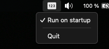

# numlock-tray

Simple tray application for displaying and changing the Num lock state in Karabiner



Usage:

-   The Karabiner variable is called "numlock"
-   Click the tray icon to toggle it
-   Use the numlock-cli utility to change it from the terminal
-   Check example karabiner.json rule [here](EXAMPLE.md)

## Development

Setup (needs [Rust](https://rustup.rs/)):

```
cargo install tauri-cli
```

Development:

```
cargo tauri dev
```

Build:

```
cargo tauri build
```
